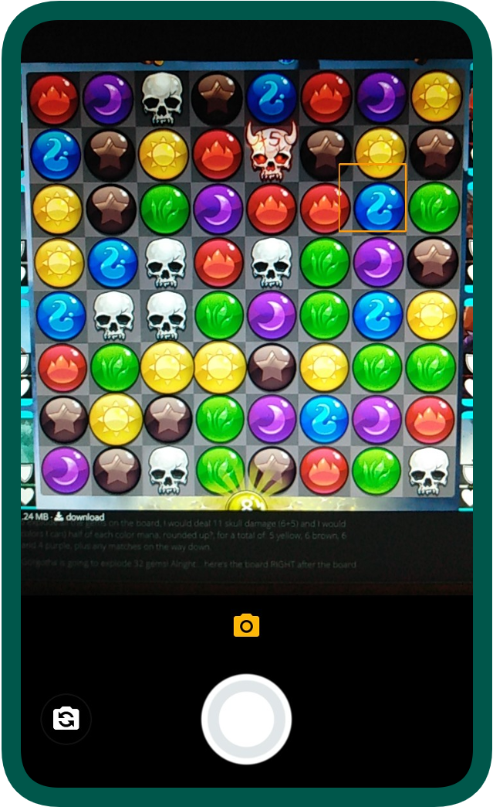
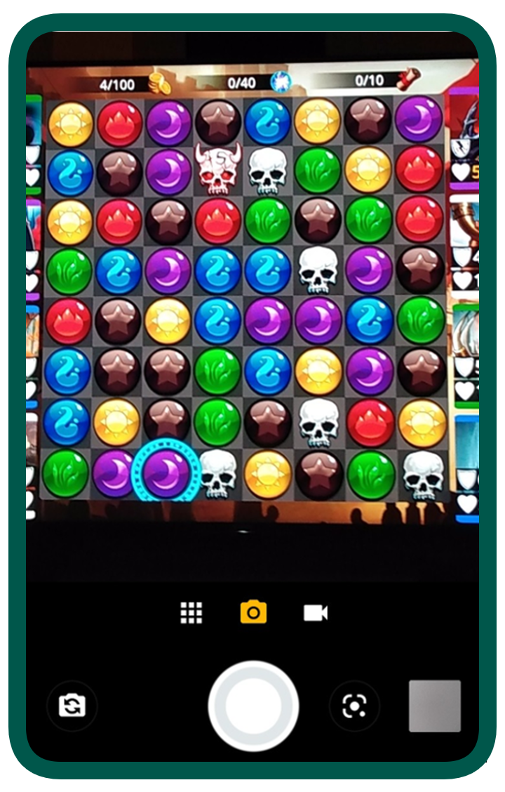
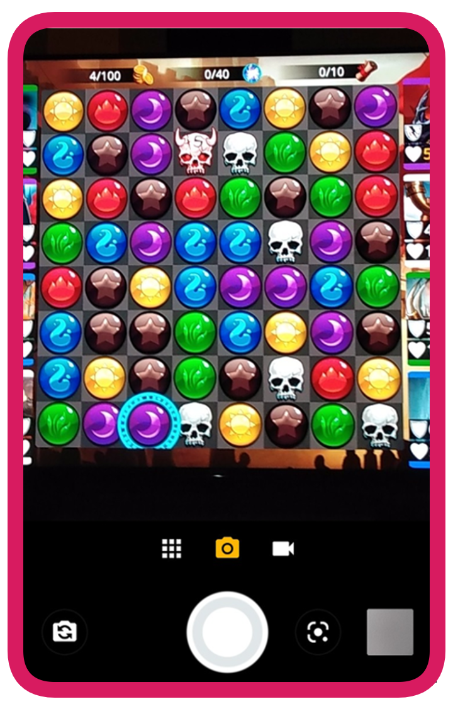
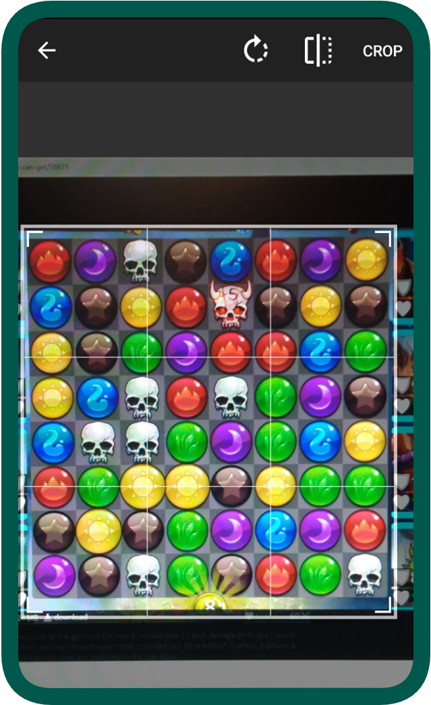
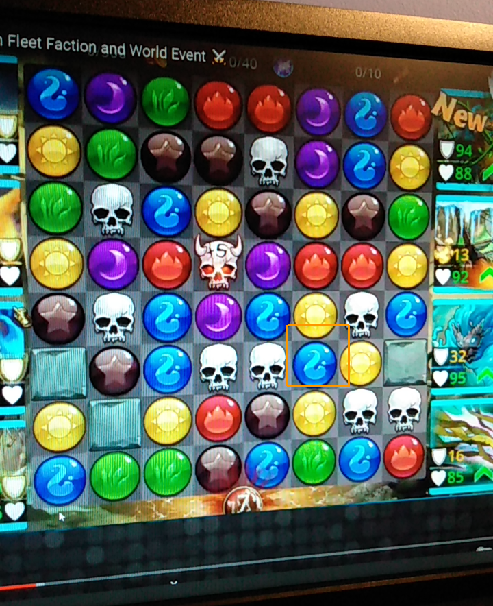
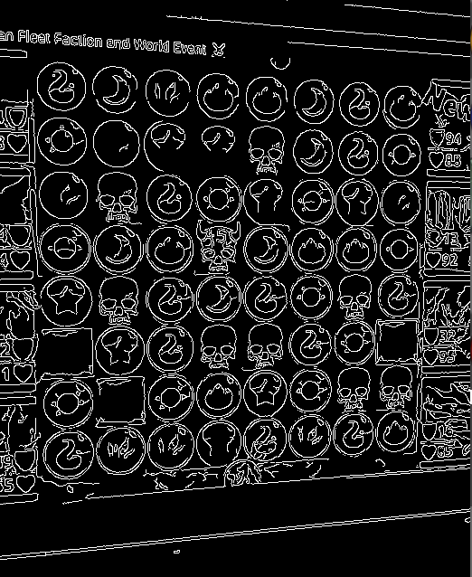
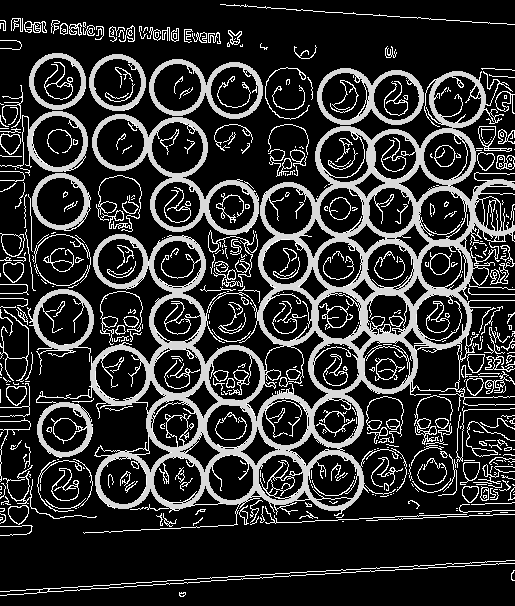
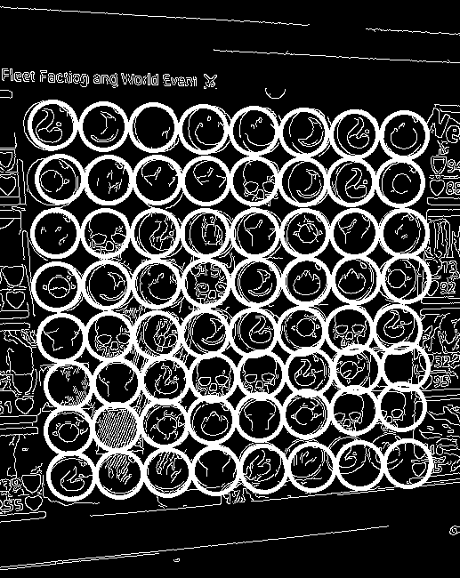
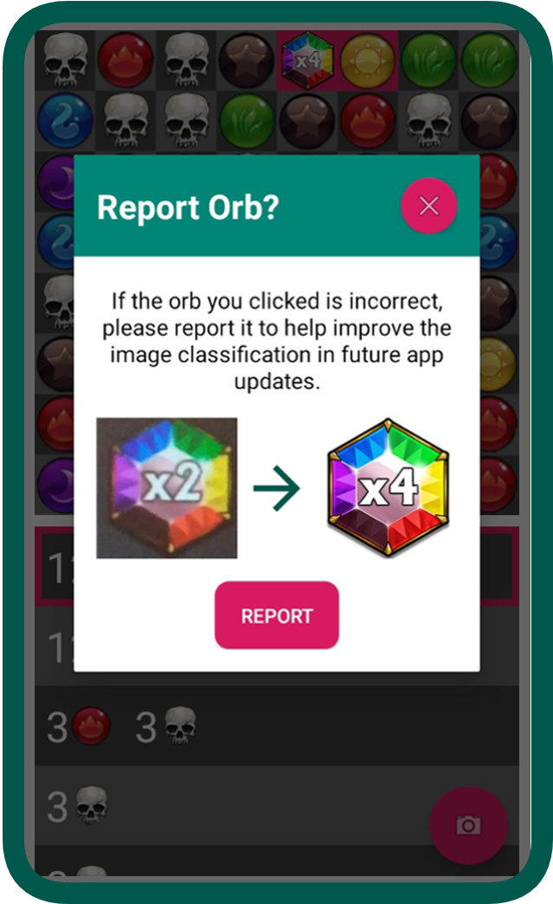

# ***Gems of War Lifeline***

## **Overview:**
*Gems of War Lifeline* is an android application that calculates and displays the optimal moves in *Gems of War*  (a match-3-style video game) from a picture of the game board. The app uses image recognition algorithms to identify the location of the game board from the picture, and it uses machine learning to identify the individual gems on the board. Once it has an internal representation of the game board, it efficiently ranks all the possible moves and displays them for the user.

## **How It Works:**
### *Step 1: Take Picture*
To get started, take a picture of the board using the in-app camera. To get the most reliable results, zoom into the board and don't include the troops in the picture.
 

 

### *Step 2: View Possible Moves*
A list of all the possible moves will be displayed. If you click one of the possible moves, the swapped gems will be highlighted in pink.

 

### *Step 3: View Next Board*
If you hold down one of the possible moves, the next board and possible moves will be shown. The gems from skyfall are unknown and will be displayed with a question mark.

 

## **Challenges And Solutions:**

### **Challenge 1: How do you find the position of the gems in the picture?**

### *Solution 1-1: Make the user crop the photo*
The first approach I used to solve this problem was to force the user to crop the image to just the gem board. Next, I would divide the cropped image into an 8x8 grid to get the position of the gems (each gem will be processed individually in a later stage). For the implementation, I used the [CanHub Android Image Cropper](https://github.com/CanHub/Android-Image-Cropper).

While this is a good first solution, it still has some problems. First of all, the user must crop the image very accurately or else some gems will be cut off when dividing the board into an 8x8 grid. Secondly, gem board must be perfectly alligned in the image or else the shape of the gem board will not be a square and it will be impossible to crop accurately. Overall, I found that manual crop is not a user-friendly solution because it takes too much time and effort to work properly.

### *Solution 1-2: Use image recognition algorithms*
A more user-friendly solution would be to automatically detect the position of the gems in the image. The algorithm I came up with uses the following three steps:

1. Use the OpenCV Canny Edge Detection algorithm to detect the edges of the image.

2. Use the OpenCV Hough Circle Transform algorithm to detect the circles (which correspond to the gems) in the image.

3. Interpolate the position of the 8x8 grid of gems from the circles found in the previous step.

This solution was challenging to implement and came with its own set of problems. First of all, I needed a way to tune the threshold hyperparameters for the Canny Edge Detection and Hough Circle algorithms. While a set of hyperparameters might work well on an one image, it would not work on images with different angles and lighting. To resolve this issue, for every image that the user takes the app tries multiple iterations of the Canny Edge Detation and Hough Circle algorithms with varying hyperparameters until it is able to interpolate the position of the 8x8 grid of gems with a high probablity. Despite running each algorithm multiple times, the entire process can be completed in around a second.

The second issue that I had to address was how to interpolate the position of the 8x8 grid of gems given the location of the circles in the image. In practice, even with optimal hyperparameter choice for the Canny Edge Detection and Hough Circle algorithms only 75% of the gems would correctly correspond to a circle, and there would be a few outlier circles that don't correspond to a gem at all. I solved this by using a Depth First Search algorithm where for each circle, it searches for a neighbour circle in the four directions and keeping track of the relative locations in a grid-like structure. The DFS algorithm starts from the centermost circle and uses the median circle diameter to estimate how far away it should be looking for neighbouring circles. From the resulting grid-like structure of circles it finds the 8x8 grid with the most circles, discards the outliers circles and interpolates the missing circle locations using best-fit-lines. From my testing, this 8x8 grid of circles correctly corresponds to the 8x8 grid of gems with ~95% accuracy.

 

<table>
  <tr>
    <td> </td>
    <td></td>
    <td></td>
    <td></td>
   </tr> 
   <tr>
    <td align="center">Original Image</td>
    <td align="center">Canny Edge Detection</td>
    <td align="center">Hough Circles</td>
    <td align="center">Interpolated Result</td>
   </tr> 
</table>

 

### **Challenge 2: How do you determine the the type of gem from the image?**

### *Solution 2-1: Choose the gem with the closest color*
Since each of the gems has a distinct color, the first solution I tried was matching the image to the gem with the closest average color. This worked for ~90% of the gems in a given picture, but since there are 64 gems per game board, this resulted in too many incorrect classifications. Even if a single gem does not match the picture, then the calculated best moves will be not be valid. Furthermore, once I started this project *Gems of War* decided to add more gem types to the game. In the beginning there were only 8 gems with distinct colors, but now there are 25+ gems; many of which have similar color schemes. With this in mind, I had to take a different approach to solve this problem.  

### *Solution 2-2: Use machine learning image classifcation*
The second approach I tried was using machine learning image classification. I collected 100+ sample images for each of the gem types with various lighting conditions and camera angles to use as training data. With this approach, all the 64 gems in the picture would get classified correctly ~80% of the time. While this was a large improvement from the previous classification method, when I tried the app with different devices the classification accuracy dropped significantly. 

 

### **Challenge 3: How do you ensure the gem classification works well on images from different devices?**

### *Solution 3: Add a feature to report incorrect classifications*
Different devices produce slightly different picture styles, so I needed to find a way to make the gem classification more robust. Getting training data from different devices would solve this issue, but it would be infeasible to me to collect all this data myself. The solution I came up with is adding a feature that allows users to easily report incorrect classifications. When a user reports a misclassification, the app sends the image of the incorrectly classified gem to a Firebase cloud storage container. I use these images as training data to improve the machine learning model. 

