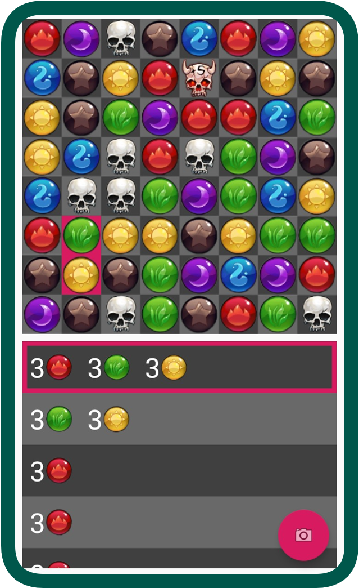
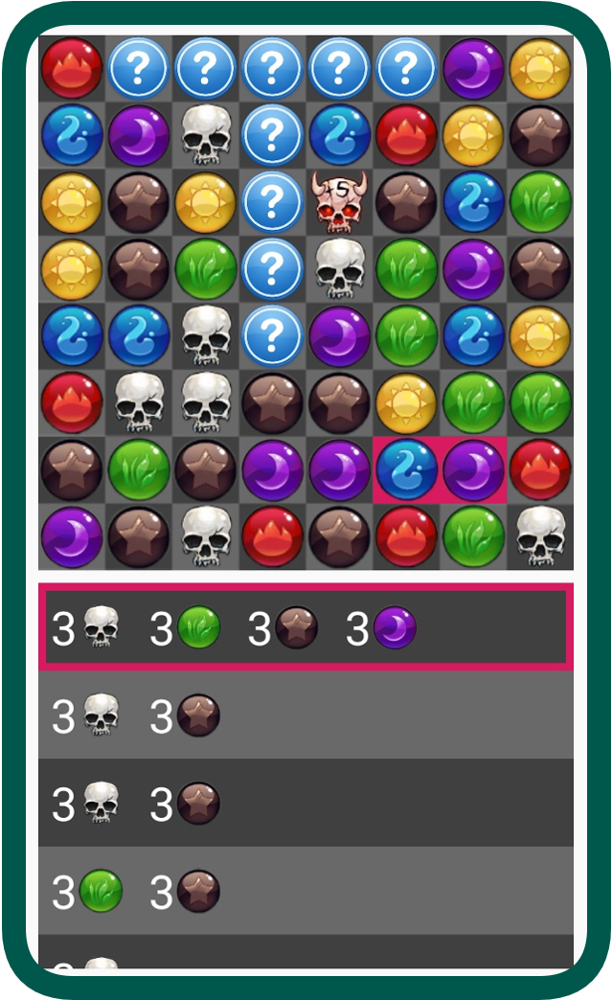

# ***Gems of War Lifeline***

## **Overview:**
*Gems of War Lifeline* is an android application that calculates and displays the optimal moves in *Gems of War*  (a match-3-style video game) from a picture of the game board. The app uses image recognition algorithms to identify the location of the game board from the picture, and it uses machine learning to identify the individual gems on the board. Once it has an internal representation of the game board, it efficiently ranks all the possible moves and displays them for the user.

## **How It Works:**
### *Step 1: Take Picture*
To get started, take a picture of the board using the in-app camera. To get the most reliable results, zoom into the board and don't include the troops in the picture.
 

 

### *Step 2: View Possible Moves*
A list of all the possible moves will be displayed. If you click one of the possible moves, the swapped gems will be highlighted in pink.

 

### *Step 3: View Next Board*
If you hold down one of the possible moves, the next board and possible moves will be shown. The gems from skyfall are unknown and will be displayed with a question mark.

 

## **Challenges And Solutions:**

### **Challenge 1: How do you find the position of the gems in the picture?**
### *Solution 1-1: Make the user crop the photo*
The first approach I used to solve this problem was to force the user to crop the image to just the gem board. Next, I would divide the cropped image into an 8x8 grid to get the position of the gems (each gem will be processed individually in a later stage). For the implementation, I used the [CanHub Android Image Cropper](https://github.com/CanHub/Android-Image-Cropper).

While this is a good first solution, it still has some problems. First of all, the user must crop the image very accurately or else some gems will be cut off when dividing the board into an 8x8 grid. Secondly, gem board must be perfectly alligned in the image or else the shape of the gem board will not be a square and it will be impossible to crop accurately. Overall, I found that manual crop is not a user-friendly solution because it takes too much time and effort to work properly.

### *Solution 1-2: Use image recognition algorithms*
A more user-friendly (and challenging to implement) solution would be to automatically detect the position of the gems in the image. The algorithm I came up with uses the following three steps:

1. Use the OpenCV Canny Edge Detection algorithm to detect the edges of the image.
2. Use the OpenCV Hough Circle Transform algorithm to detect the circles (which correspond to the gems) in the image.
3. Interpolate the position of the 8x8 grid of gems from the circles found in the previous step.

